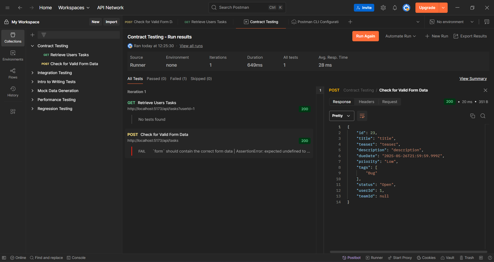

# Manual API Testing Documentation

As part of the maunal API testing we used `Postman` to test the API endpoints.

## Postman

With Postman we tested the API endpoints for `POST api/tasks` and `GET api/tasks`.

The configuration file to import the Postman collection can be found in the `docs/template/Contract Testing.postman_collection.json` file.

### Experience

Because we were familiar with Postman we were able to quickly set up the tests and start validating the API endpoints.
As an experience we found that Postman provides a user-friendly interface to test API endpoints allowing us to easily send requests and view responses. 
The ability to organize requests into collections was particularly helpful for managing different test scenarios and exporting them.
Sometimes it is a bit confusing to distinguish between collection variables and environments but once you get used to it it becomes easier to manage.

### Summary

Overall Postman proved to be a valuable tool for manual API testing enabling us to efficiently validate the functionality and reliability of our API endpoints.
As a bonus, it provides a way to integrate the test collection into a CI/CD pipeline allowing automated testing.
