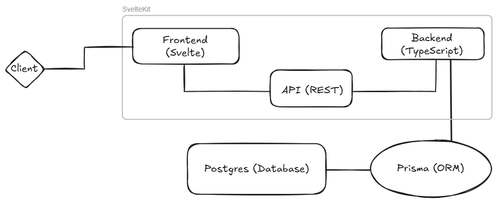

# FocusFlow Presentation

Overview and key points of our FocusFlow implementation.

## 1. Implementation overview

### Tech stack

- **Frontend:** Svelte + TypeScript
- **Backend:** SvelteKit + TypeScript
- **ORM:** Prisma
- **Database:** PostgreSQL
- **Tools:** Docker + GitHub

### Key implementation

- **REST API:**
    - `/tasks` [GET, POST, PUT, DELETE]
- **Authentication:** Selfmade authentication
- **State management:** Svelte events
- **Data model:** Generated with Prisma [see model](../../prisma/schema.prisma)

### High-level architecture



### Tools / services integrated 

- **CI/CD:** GitHub Actions
- **Deployment:** BwCloud ([FocusFlow](https://focusflow.professornova.de))
- **Testing:** Vitest and Playwright

### Short live demo

Show Focusflow in action.

## 2. Requirements recap

| Requirement | Initial usage | State of implementation | UX/UI Factors |
|-|-|-|-|
| **Quality Attributes** |
| Functional Suitability | (Number of functional requirements met) | Mostly implemented | Completeness |
| Usability | (Number of clicks and time to complete specific actions. Average number of notifications after login) | Implemented | Clarity, Convenience |
| Security | (Number of unauthorized access attempts, number of successful unauthorized access attempts) | Implemented | Trust |
| Maintainability | (Average number of LOC per module, number of modules, average number of comments per module and code coverage of the test suite) | Implemented | Efficiency |
| **Functional and Non-Functional Requirements** |
| The software needs to have a UI | Show functionality to the user | Implemented | Convenience |
| It should be possible to create tasks | Create tasks in every layer (also through the UI) | Implemented | Usefulness |
| It should be possible to manage tasks | Manage tasks including editing and deleting | Implemented | Adaptability |
| It should be possible to organize tasks based on complexity | Have tasks in order | Implemented | Clarity |
| It should be possible to create users with whole authentication logic | Separate access for users | Implemented | Trust |
| It should be possible to create teams and assign users to teams | Group users into teams | Postponed/Dropped | Clarity |
| It should be possible to assign or share tasks within small teams | Increase collaboration and efficiency | Dropped | Efficiency |
| It should be possible to assign deadlines to tasks | Clear definitions of deadlines | Implemented | Clarity |
| It should be possible to give tasks status | Seeing the progress of tasks | Implemented | Clarity |
| Clean and logical UI | Help the user understand the application | Implemented | Transparency, Controllability |
| Have intuitive visual feedback | Give feedback on user actions | Implemented | Timeliness |
| The user should not be overwhelmed with notifications | Keep messages relevant and timely | Implemented | Clarity |

## 3. Retrospective & Lessons learned

### Organization

As described in the [organization](../organization/team-roles.md) section, we had one group leader and a more or less strict division of roles into frontend, backend, database management and testing.

The frontend was done by Florian Wieland and Pablo Rodriguez, the backend was mainly done by Florian Wieland with some contributions of the rest of the team, the database was mainly done by Simon Raichle and testing was done by Alexander Laukart and Pablo Rodriguez.</br>
The documentation was done of the team member who did the respective part of the implementation or had time to do it.


### Challenges during the implementation

- **Maintenance of framework syntax:** 
    - **Vitest** is still in development and has some changes during their release cycle. This made it sometimes challenging to keep the project up-to-date in case of testing. For example, there are two different configurations for Vitest (vite.config - for SvelteKit application, vitest.config - especially for vitest testing framework), both inherit from a root configuration, but one has a higher priority and can override the other configurations.
    - **Svelte** released a stable version of Svelte 5 and we had to adapt to their newer syntax (runes, etc.).

- **Security:** Implementing our own authentication logic was a challenge... It also lead to challenges within some test cases.


### What worked well

- Normal testing with the vitest framework was very easy due to its great documentation and simplicity for example when using mocks and spies.
- Learning the syntax for the Playwright testing framework was straightforward also because it is similar to the vitest framework.

### What didn't work well

- BDD tests with Playwright, Cucumber and SvelteKit were not as easy as expected. Cucumber has no support for SvelteKit and TypeScript.

###  Which exercise helped the most or was the most interesting for your team?

- Nothing specific stood out, but the overall experience of working with the testing frameworks was valuable.


### What would your team do differently in the next iteration?

- Focus more on the integration of the tools and keep the tests and functionality simpler.

### What would your team suggest to change during the lecture / course?

- In the first lecture an overall summary of the functionality the application should provide at the end.

## Additional aspects

As mentioned the application is deployed on BwCloud and can be accessed at [https://focusflow.professornova.de](https://focusflow.professornova.de).

Tests can be found in the `tests` directory.
The list of execution commands can be found in the `package.json` file.
``` json
{
    "test": "vitest --project=unit",
    "test-cucumber": "cross-env DEBUG=false cucumber-js --config cucumber.cjs",
    "debug-cucumber": "cross-env DEBUG=true cucumber-js --config cucumber.cjs",
    "coverage": "vitest run --coverage",
    "test-ui": "vitest --project=browser --browser.headless",
    "debug-ui": "vitest --project=browser",
    "test-all": "vitest --project=unit --project=browser"
}
```
